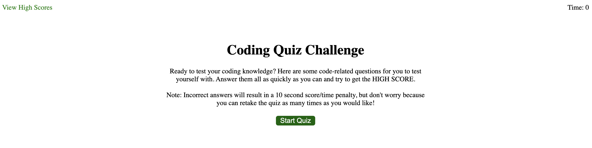

# Coding Quiz

## Table of Contents:
- [Description](#description)
- [Links](#links)
- [Questions](#questions)

## Description:
A twelve question multiple choice quiz. This quiz is geared towards beginners and can be taken as many times as desired in order for users to learn the answers to all questions. Once on the quiz homepage as depicted below, users can either click View High Scores in the top left corner to view previous scores or click the start button to begin the quiz.

## Links

  * Application URL: (https://bortkyle18.github.io/code-quiz/)
  * Github Repository URL: (https://github.com/bortkyle18/code-quiz)

## Questions

   

  Feel free to reach me at bortkyle18@gmail.com with any question regarding this project!